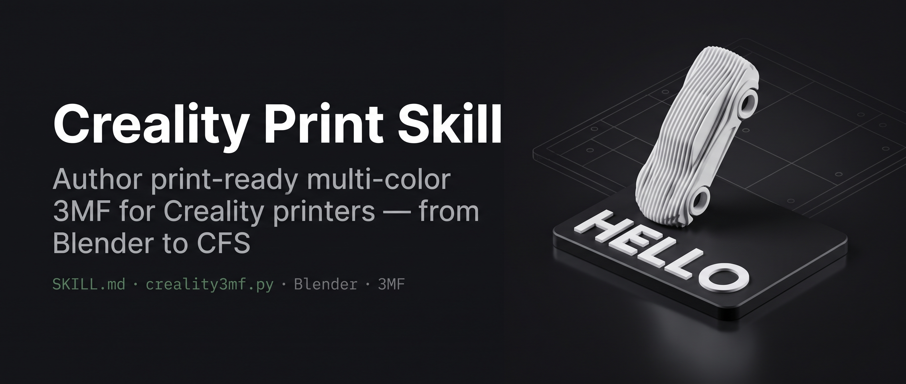
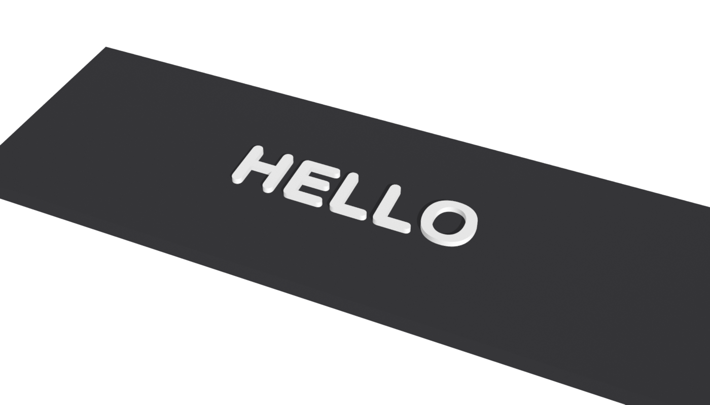

# Creality Print Skill

**Print-ready multi-colour 3MF for Creality (创想三维) printers — one object, N parts, one filament slot per part — verified against Creality Print's own loader.**



  

[Skill](SKILL.md) · [3MF anatomy](reference/3mf-anatomy.md) · [Pitfalls 踩坑](reference/pitfalls.md) · [Geometry sources](reference/geometry-sources.md) · [Compatibility](reference/compatibility.md) · [Issues](https://github.com/KeWang0622/creality-print-skill/issues)

An agent skill (`SKILL.md`) plus a zero-dependency tool (`creality3mf.py` + `data/printers.json`) that turns STL/OBJ parts or a Blender scene into a `.3mf` that Creality Print opens as a single multi-colour object, centred on the bed, with every part already assigned to a CFS slot. Bambu Studio and OrcaSlicer share the loader this was checked against (not yet verified on them — see the compatibility matrix).



```bash
bash scripts/dev.sh install     # Python >= 3.9, nothing else
bash scripts/dev.sh example     # builds examples/out/nameplate.3mf and inspects it
```

```
examples/out/nameplate.3mf
  application: Creality_Print V7.2.1.5476 Release   sliced: False
  object 2 'nameplate HELLO' extruder=1 bbox [115.0, 137.0, 0.0] -> [185.0, 163.0, 4.0]
      part 1 'Plate' extruder=1
      part 3 'Lettering' extruder=2
```

Open that file in Creality Print with **File → Open Project**, put black in CFS slot 1 and white in slot 2, slice.

## Use it

**As a Claude Code / agent skill** — `npx skills add KeWang0622/creality-print-skill` (Vercel Skills CLI), or copy/symlink this folder into `~/.claude/skills/creality-print/`. `SKILL.md` carries the workflow, the design rules, the Blender recipe, the CLI gotchas and a delivery checklist; the scripts do the work.

**As a tool**

```bash
# your own parts (millimetres, z-up); extruder = 1-based filament slot
python3 creality3mf.py build -o model.3mf --printer "Creality K2 Plus" \
    --part plate.stl:1:Plate --part body.stl:2:Body --part text.stl:2:Lettering \
    --filament "#000000" --filament "#FFFFFF" --project-from a_file_your_creality_print_saved.3mf

python3 creality3mf.py check plate.stl:1 body.stl:2 --printer "Creality K2 Plus" --slots 2   # watertight / units / overlap / fit
python3 creality3mf.py inspect model.3mf        # objects, parts, extruders, bbox, sliced?
python3 creality3mf.py printers                 # 55 Creality machines, beds from vendor profiles
```

**From Blender (headless)**

```bash
blender -b --python examples/blender_text_plate.py -- --text "MAKER" --out /tmp/p --build \
    --font "/System/Library/Fonts/Supplemental/Arial Rounded Bold.ttf"
```
Material names `E1_…` / `E2_…` (or an object property `extruder`) decide the slot; `scripts/blender_export_parts.py` writes STL parts + `parts.json` for any scene.

**From CadQuery / OpenSCAD / build123d / trimesh / text-to-cad** — anything that writes STL in mm is a valid input; snippets in [`reference/geometry-sources.md`](reference/geometry-sources.md). In a [text-to-cad](https://github.com/earthtojake/text-to-cad) pipeline this is the per-part-slot stage between `$cad` and the slicer.

## Why this exists

Creality's slicer is a Bambu Studio fork, so the 3MF rules are the same — but nobody had written them down for Creality, and the CLI has its own traps (a version gate, per-file filament ids, crashes on multi-colour slicing). Every rule here was checked against `bbs_3mf.cpp` and against a real K2 Pro job (black plate, white body, white lettering), and the twenty things that went wrong on the way are in [`reference/pitfalls.md`](reference/pitfalls.md).

## How it works

```
STL / OBJ / Blender objects           creality3mf.py build                  Creality Print
 ┌──────────┐  ┌──────────┐            ┌────────────────────────┐            ┌──────────────┐
 │ Plate    │  │ Lettering│  ──mm──►   │ 3D/3dmodel.model       │  ──3mf──►  │ 1 object     │
 │ slot 1   │  │ slot 2   │            │  object 2 = components │            │  part Plate 1│
 └──────────┘  └──────────┘            │ 3D/Objects/object_2    │            │  part Text  2│
                                       │ Metadata/model_settings│            │ on the bed   │
   centre on bed, z=0, fit check       │  part.extruder = slot  │            │ colours set  │
                                       └────────────────────────┘            └──────────────┘
```

One object with `<part>` children is what Creality Print writes itself; per-part `extruder` metadata survives import only on multi-part objects, and separate objects are what trigger "too close to others" and lost parts. The full anatomy, with line references, is in [`reference/3mf-anatomy.md`](reference/3mf-anatomy.md).

| Doc | What is in it |
|---|---|
| [`SKILL.md`](SKILL.md) | the agent workflow, rules, checklist (EN + 中文速览) |
| [`reference/3mf-anatomy.md`](reference/3mf-anatomy.md) | every file in the container, UUID scheme, loader behaviour |
| [`reference/pitfalls.md`](reference/pitfalls.md) | 20 real failures and fixes, bilingual |
| [`reference/design-rules.md`](reference/design-rules.md) | wall/stroke/height minimums, purge, slot order, CFS limits |
| [`reference/blender.md`](reference/blender.md) | headless extension enabling, units, text, splitting |
| [`reference/geometry-sources.md`](reference/geometry-sources.md) | CadQuery / OpenSCAD / build123d / trimesh / manifold as inputs, what each lacks |
| [`reference/creality-print-cli.md`](reference/creality-print-cli.md) | options, version gate, known crashes |
| [`reference/compatibility.md`](reference/compatibility.md) | verified vs expected, per slicer version |
| [`reference/sources.md`](reference/sources.md) | every citation |

## Roadmap

- a photo of the real K2 Pro print next to the `inspect` block
- `Slic3r_PE_model.config` + `slic3rpe:extruder` so PrusaSlicer keeps part colours
- fixture 3MFs verified in CI against a recorded Creality Print `--info`; verified Bambu Studio / OrcaSlicer rows
- minimum stroke-width measurement in `check` (text-to-cad's dfam-check style)

## License and credits

MIT. Format knowledge from [CrealityPrint](https://github.com/CrealityOfficial/CrealityPrint) / [BambuStudio](https://github.com/bambulab/BambuStudio) source (AGPL-3.0, not vendored) and the [3MF Consortium](https://3mf.io) specs; Blender path via the [3MF Import/Export extension](https://extensions.blender.org/add-ons/threemf-io/). Prior art that this does not repeat: [Kiln](https://github.com/codeofaxel/Kiln) and [bambu-printer-mcp](https://github.com/DMontgomery40/bambu-printer-mcp) write multi-part 3MF for Bambu Studio but are MCP servers (not vendorable into a skill), clone templates rather than write the structure, and do not cover Creality's loader, `creality.config` or the CLI version gate; [k2-3d-printing-skill](https://github.com/woliveiras/k2-3d-printing-skill) documents the K2 GUI but has no writer; [blender-mcp](https://github.com/ahujasid/blender-mcp) drives Blender live and knows nothing about 3MF.

---

# 中文说明

**给创想三维（Creality）打印机做多色打印文件：一个物体、多个 part、每个 part 绑定一个耗材槽，按 Creality Print 自己的加载器规则生成并验证。**

## 它解决什么

你有一个模型（STL/OBJ/Blender），想让底板一种颜色、字或 logo 另一种颜色，在 K2 / K1 + CFS 上一次打完。常见的失败：颜色没进去、字不见了、模型跑到平台外、"too close to others"、命令行报版本不支持。这个仓库把规则查清楚（对照 `bbs_3mf.cpp` 源码和真实 K2 Pro 打印）并做成工具 + skill。

## 三步

```bash
bash scripts/dev.sh install
bash scripts/dev.sh example       # 生成 examples/out/nameplate.3mf（黑底板 + 凸起白字 HELLO）
python3 creality3mf.py inspect examples/out/nameplate.3mf
```

零件先过一遍 `python3 creality3mf.py check 底板.stl:1 文字.stl:2 --printer "Creality K2 Pro" --slots 2`（水密 / 单位 / 重叠 / 槽位 / 平台）。

在 Creality Print 里 **文件 → 打开工程**，CFS 1 号槽放黑、2 号槽放白，切片即可。

## 自己的零件

```bash
python3 creality3mf.py build -o model.3mf --printer "Creality K2 Plus" \
    --part 底板.stl:1:Plate --part 车身.stl:2:Body --part 文字.stl:2:Lettering \
    --filament "#000000" --filament "#FFFFFF" --project-from 你的CrealityPrint保存过的.3mf
```

- 单位毫米、Z 向上；`:1` `:2` 是耗材槽号（1 开始）
- 工具会把整组居中到平台、落到 z=0，放不下直接报错
- 不带 `--project-from` 就是"纯模型 3MF"，打开后用你当前的打印机和耗材；带上则连预设和颜色一起进文件

## Blender

```bash
blender --command extension install ThreeMF_io
blender -b --python examples/blender_text_plate.py -- --text "MAKER" --out /tmp/p --build
```
材质名 `E1_xxx` / `E2_xxx` 决定槽位。无头脚本里要自己 `addon_utils.enable("bl_ext.blender_org.ThreeMF_io")`。

## 规则速记（0.4 喷嘴）

笔画 ≥ 0.9 mm，凸字 0.8–1.0 mm，字高 ≥ 10 mm 用粗体，孤立小点 ≥ 2 mm，底板 ≥ 2.4 mm；黑色放 1 号槽省擦料；多色会自动开擦料塔，别关。

## 作为 skill

把整个目录放到 `~/.claude/skills/creality-print/`，`SKILL.md` 里有完整流程、坑表和交付清单（含中文速览）。

## 兼容

Creality Print 7.2.1 ✅ 已验证（GUI + CLI）· 6.x / Bambu Studio / OrcaSlicer：同一加载器代码，未逐一验证 · PrusaSlicer / Cura 只读几何。详见 [`reference/compatibility.md`](reference/compatibility.md)。
